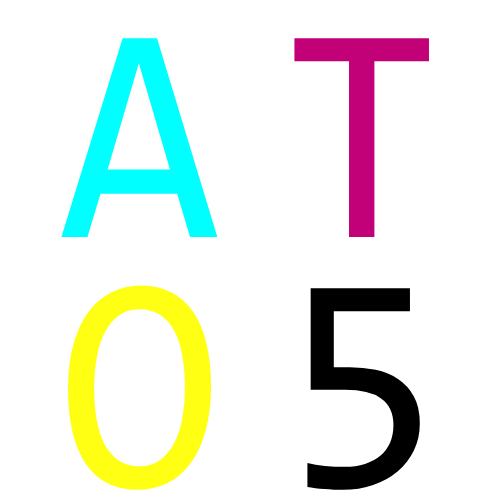

<style>
#index_h1 {
  text-align:center;
  font-size: 24px;
}
#dec {text-align:center;}

.info {
    display: flex;
    justify-content: center;
}

.info img {
    margin: 0 10px;
    width: 15%;
    object-fit: cover;
}
</style>


<p id="logo">

</p>

<p id=index_h1>
ATO Client
</p>


------


<p id="dec">
  一个快速监控取证的工具
</p>


<div class="info">


</div>


## 重要文件目录结构

```
  ATO
    ├─ATO.exe                   # 启动程序
    ├─pic                       # 图片下载及处理文件夹
    └─_internal
        ├─app
        │  ├─dh_netsdk_log      # 大华SDK操作日志
        │  ├─hk_netsdk_log      # 海康SDK操作日志
        │  └─main.log           # 主程序日志
        ├─AppData
        │  ├─config.ini         # 界面配置文件
        │  └─月台配置.xlsx       # 月台对应监控通道配置文件
        │
        └─UnifyNetSDK           # 统一厂商SDK接口的模块
           ├─dahua              # 如果你也有兴趣开发类似的项目可以看看
           └─haikang            # 项目地址:https://gitee.com/picklemorty/UnifyNetSDK

```

------


## 界面预览










## ATO Client | ATO5 | v1.0.0 这些英文字符都是什么含义？

ATO Client 是这个代码项目的命名，其中Client是名副其实的客户端的意思。不过服务端可能还要等好久，计划是服务端运行一个yolo，可以自动标记图片。

ATO5 是这个软件的logo，其中5 的含义是这个项目已经 经过5次技术迭代了(高情商)。

v1.0.0 讲明白了上面那些，最后这个就是软件版本号了，ATO经过5次技术迭代的第一个版本。
